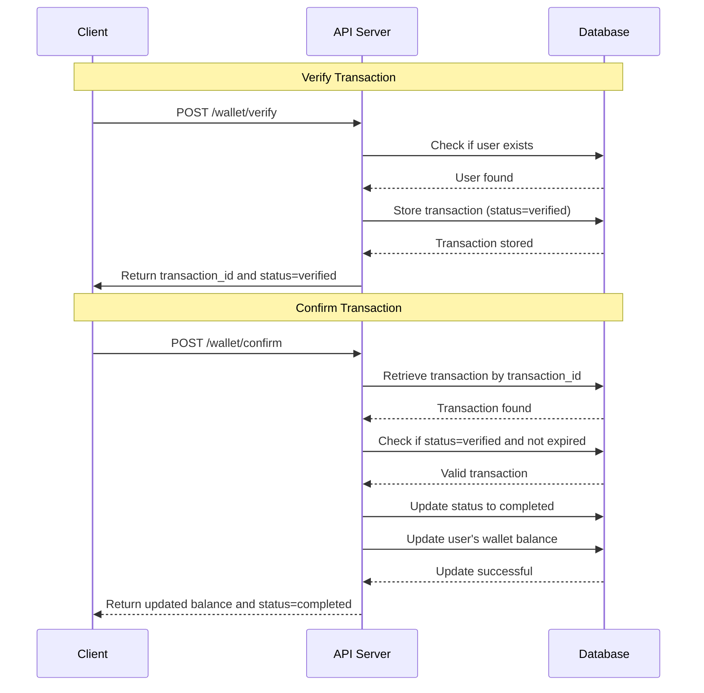

# Wallet Top-up System

## Required
1. Docker (ensure you can access docker in command line)
2. Docker Compose
3. GNU Make (Makefile)
4. Golang (ensure you can access go in command line)

## Tech Stack
1. Golang
2. GoFiber
3. PostgreSQL
4. Redis
5. Testcontainers (Redis, PostgreSQL)

## Getting Started
1. Open your terminal
2. Go to project folder
3. Type command
    ```bash
    go mod tidy
    ```
4. Type command in each mode you want
    - `make run-compose` for start with docker-compose
    - `make develop-compose` for start with development hot reload and docker-compose

## Testing
```bash
go test ./...
```

## Example
### Verify Transaction
```bash
curl --location 'localhost:3000/wallet/verify' \
--header 'x-correlation-id: test' \
--header 'Content-Type: application/json' \
--data '{
    "user_id": 1,
    "amount": 50,
    "payment_method": "credit_card"
}'
```

### Confirm Transaction
```bash
curl --location 'localhost:3000/wallet/confirm' \
--header 'Content-Type: application/json' \
--data '{
    "transaction_id": "{{INSERT YOUR TRANSACTION ID}}"
}'
```

## Sequence Diagram

