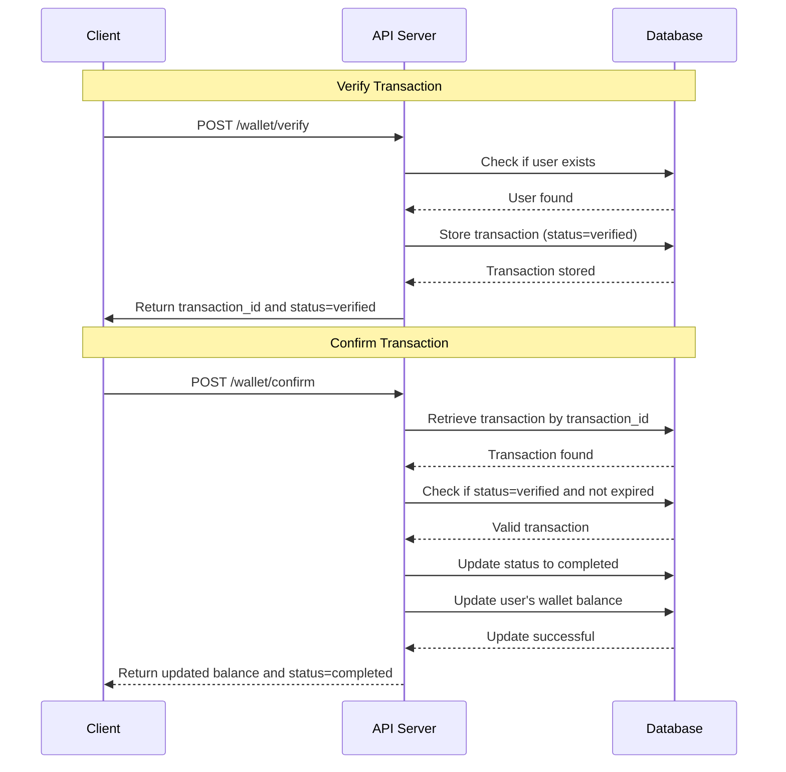

# Wallet Top-up System

## Getting Started
-- TBC --

## Sequence Diagram

```mermaid
sequenceDiagram
  participant Client
  participant API Server
  participant Database

  Note over Client, Database: Verify Transaction
  Client ->> API Server: POST /wallet/verify
  API Server ->> Database: Check if user exists
  Database -->> API Server: User found
  API Server ->> Database: Store transaction (status=verified)
  Database -->> API Server: Transaction stored
  API Server ->> Client: Return transaction_id and status=verified

  Note over Client, Database: Confirm Transaction
  Client ->> API Server: POST /wallet/confirm
  API Server ->> Database: Retrieve transaction by transaction_id
  Database -->> API Server: Transaction found
  API Server ->> Database: Check if status=verified and not expired
  Database -->> API Server: Valid transaction
  API Server ->> Database: Update status to completed
  API Server ->> Database: Update user's wallet balance
  Database -->> API Server: Update successful
  API Server -->> Client: Return updated balance and status=completed
```
